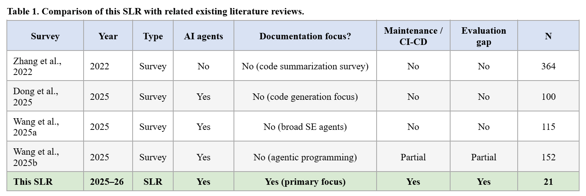

> _This is a draft version for Section 1: Introduction - 11.04.2026_

### SECTION 1 : INTRODUCTION

#### Context and Motivation

For software developers, understanding the program they will be working on takes up approximately 58% of their time (Xia et al., 2018). The greatest resource they can utilize during this process is the software's documentation. If this documentation is high-quality, it not only increases developer productivity but also facilitates the recruitment of new employees. Software with high-quality documentation prevents the accumulation of technical debt and is also efficient in terms of reusability. For example, even if the original developers who wrote the code cannot be reached, the risks in terms of maintenance and sustainability are definitely lower compared to software with low-quality documentation (De Souza, 2005; Etemadi, 2022). However, even in the most widely used open-source repositories on the popular version control system GitHub platform, the docstring coverage rate consistently falls below 30% (Yang et al., 2025). The existing documentation is often incomplete, contradicts the basic code structure, or is completely absent in components that are frequently modified (Aghajani et al., 2019).

It is known that studies on automated documentation generation have been ongoing since the 2000s to solve this problem  (Forward & Lethbridge, 2002). For example, after methods such as template-based methods, information retrieval, and deep learning-based summarizers, approaches supported by the Large Language Models have been developed. With each method and tool, it is observed that documentation is gradually approaching human quality. Some popular open and closed-source models such as GPT-4 (OpenAI, 2023), CodeLlama (Rozière et al., 2023), and DeepSeek Coder (Guo et al., 2024) have been shown to be of the same or higher quality as documentation written by developers (Yang et al. 2025; Etemadi & Robles, 2025).

While these developments seem like promising solutions to the documentation debt problem, a more detailed look is necessary because there is currently a shift from LLM-based code summarizers to AI agents. Of course, AI agents are expected to be involved not only in the documentation generation phase but also in phases such as rewriting existing documentation according to code changes in the project.

In addition, a study analyzing 1997 documentation pull requests (PRs) from GitHub repositories found that AI agents generate approximately 2.8 times more documentation PRs than human developers (Yamasaki et al., 2026). More importantly, 34.5% of the documentation additions generated by these AI agents are merged without any subsequent human editing or deletion, and 85.7% are subject to less human editing than additions made by AI agents. This indicates that AI agents, rather than humans, are now the primary contributor to software documentation, while also raising questions about the quality assurance of software documentation. Therefore, we have concluded that it would be beneficial to position the focus of this systematic literature review as follows:

In practice, AI agents are being rapidly adopted. However, this rapid adoption is an area lacking the common assessment standards and maintenance-oriented frameworks necessary to ensure that reliable, verifiable, and sustainable quality software documentation is produced. The urgency of the situation is also evident in the exponential increase in the number of publications in this field each year.

The urgency of the situation is also evident in the exponentially increasing number of publications in this field each year. The number of unique records obtained from scanned digital databases is 604, of which 49 are from 2021, 69 from 2022, 89 from 2023, 131 from 2024, and 235 from 2025. This sharp increase in the number of publications confirms that AI agent-based software documentation is a developing research area lacking systematic synthesis.

#### AI Agents for Software Documentation

An agent is a system that understands its environment and takes actions to achieve its goal (Russell & Norvig, 2020). In this study, we define an AI agent customized for software documentation as a system with the following characteristics:
1. Able to use at least one major language model for reasoning,
2. Having the goal of generating/updating software documentation,
3. Having the ability to process not only with a single inference call but also with persistent memory, tools, and multiple steps.

Thanks to the above definition, we are deliberately excluding only simple, request-based LLM inference systems so that we can include approaches involving IDE plugins with memory, automated pipelines with Git integration, and the use of multiple agents.

Because the problem of generating documentation has already been largely solved, we can say that now the important thing is continous documentation. So systems where it is unclear when, how, and by whom the generated documentation will be updated as code development continues do not provide a complete solution to the documentation debt problem.

Furthermore, despite the rapid growth of this research field, there is currently no systematic analysis addressing AI agent-based documentation approaches. Existing research generally focuses on topics such as LLM-based code summarization and empirical analyses of documentation quality (Zhang et al., 2022; Dong et al., 2025; Wang et al., 2025a; Wang et al., 2025b).

Table 1 below presents five key limitations addressed in this systematic literature review, while also comparing this study with existing reviews:

> _This is a draft version for Section 1: Introduction - 11.04.2026_